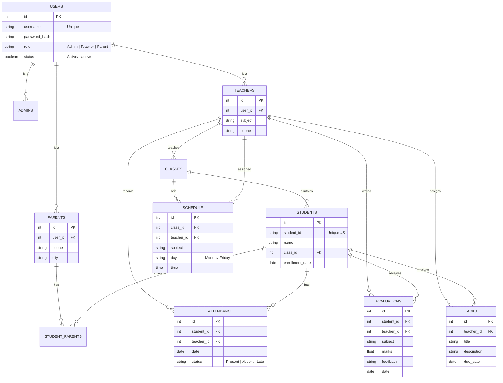

# ARAK Admin Dashboard - ERD

This document outlines the target entity relationships for the system.

## 🔗 Relationships Analysis

### 1. Unified User System (Authentication)
*   **Centralization**: The system relies on a unified `USERS` table for managing Authentication.
*   **RBAC**: Access rights are determined based on roles (Admin, Teacher, Parent) as specified in the SRS.
*   **Polymorphism**: Specific profile tables (`TEACHERS`, `PARENTS`) link back to `USERS` via `user_id`, allowing distinct profile data while sharing auth credentials.

### 2. Parent-Student Linking
*   **Many-to-Many**: Uses an intermediate table `STUDENT_PARENTS` instead of a direct foreign key.
*   **Purpose**: Allows a single Parent account to be linked to and monitor multiple Students (siblings), and supports cases where a student has multiple guardians.

### 3. Attendance & Evaluations
*   **Dual Linkage**: Every record is linked to a **TeacherID** (the authority responsible for data entry) and a **StudentID** (the subject of the record).
*   **Scalability**: This structure supports future integration with hardware solutions like **NFC** or **Biometric/Fingerprint** scanners for automated attendance.

### 4. Classes & Tasks
*   **Scoping**: Students and Teachers are linked via `class_id`.
*   **Isolation**: This ensures that tasks, schedules, and assignments are scoped correctly—users only see data relevant to their specific Class context.

